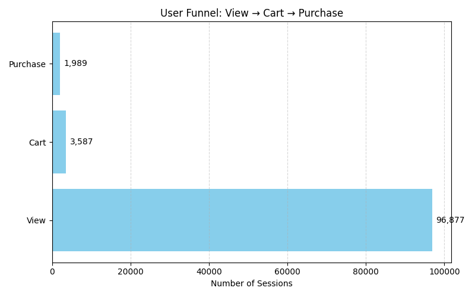

# E-Commerce Funnel Analysis

This project analyzes user session behavior from a multi-category e-commerce dataset.  
The goal is to explore where users drop off in the funnel — from viewing a product, adding it to cart, to actually purchasing it.

## Funnel Stages Analyzed

- Only View  
- View + Cart (No Purchase)  
- View + Purchase (No Cart)  
- Full Funnel (View + Cart + Purchase)

Over 96% of users drop off right after the first product view.  
But among those who add something to their cart, around 55% continue to purchase — this shows strong intent at the cart stage.

## Project Structure

| File | Description |
|------|-------------|
| src/01_load_data.py | Loads and combines October & November data  
| src/02_funnel_analysis.py | Classifies sessions and computes funnel conversion  
| charts/funnel_bar_horizontal.png | Visual chart of funnel stages  
| insights.md | Key takeaways from the funnel analysis  
| LICENSE | MIT License  
| requirements.txt | Python package dependencies  

## Sample Output



## How to Run

1. Clone the repo  
2. Install dependencies:

```bash
pip install -r requirements.txt
